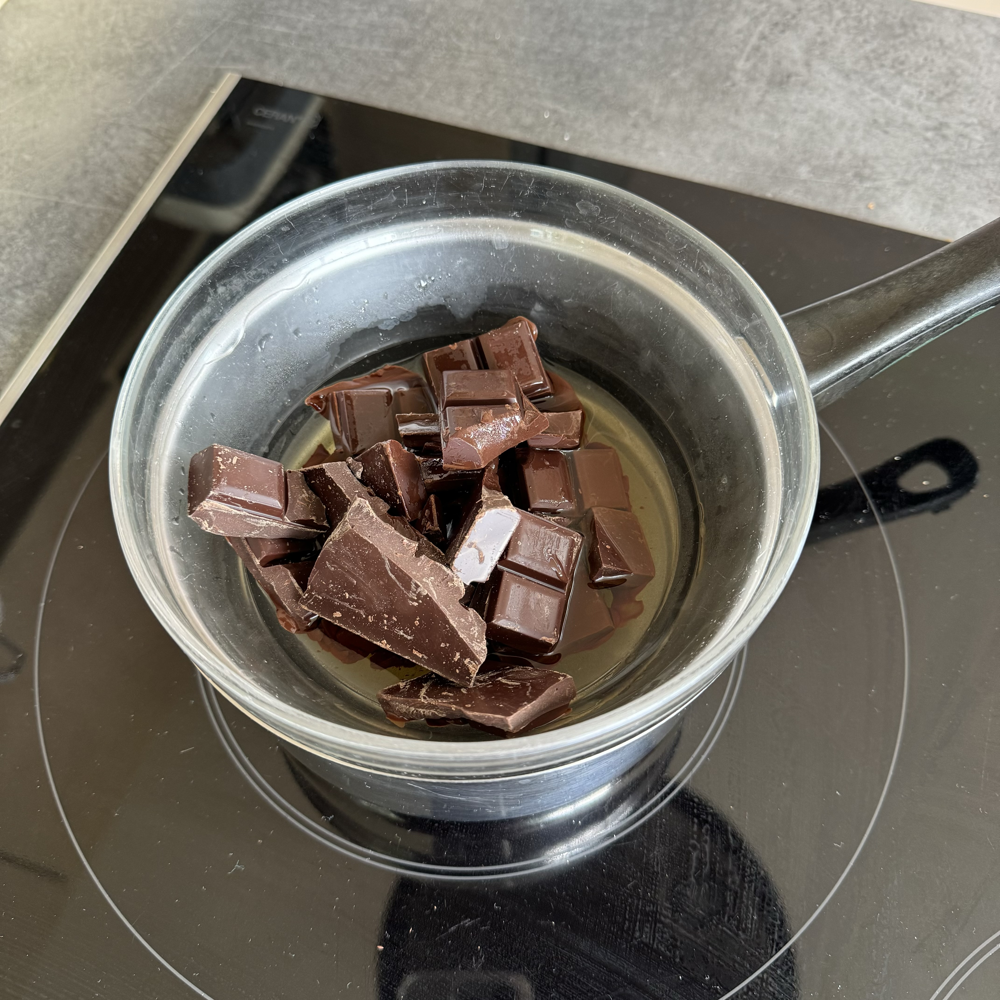
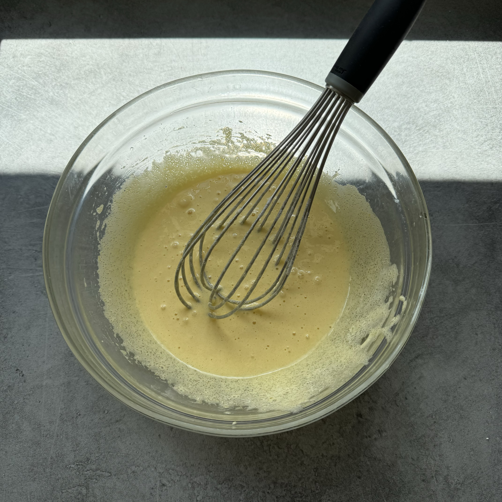
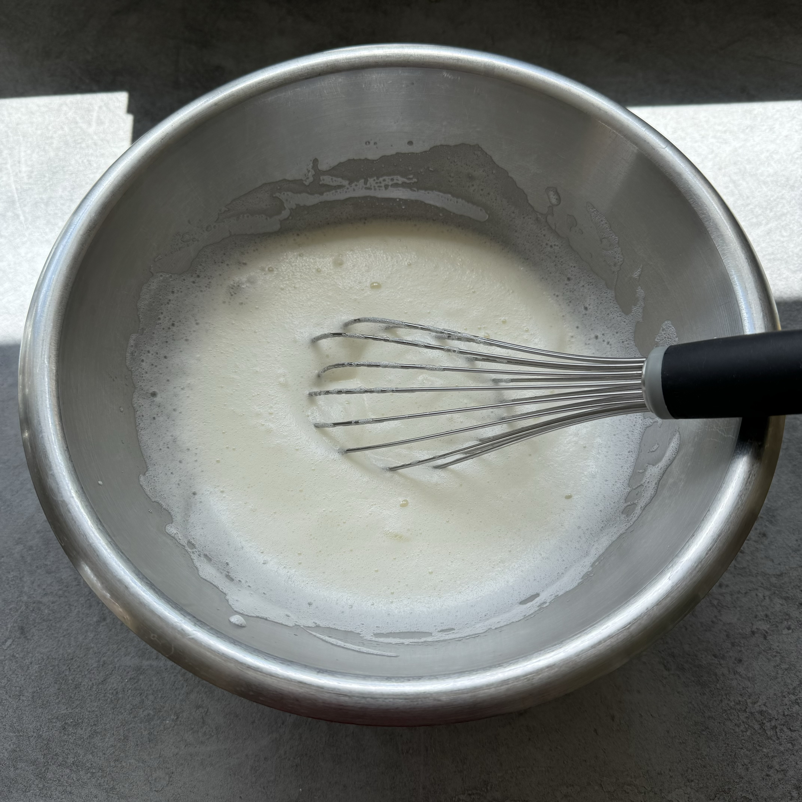

{: .recipe-image }

## Ingrédients

- **200g** de Chocolat amer
- **150g** de Sucre
- **6cl** de Cognac
- **6** Œufs
- Fleur de sel

## Recette

### Préparation

1. Faites fondre le chocolat avec le cognac au bain-marie.
2. Séparez les blancs et les jaunes d'œufs.
3. Blanchissez les jaunes avec le sucre.
4. Mélangez le chocolat avec les jaunes.
5. Montez les blancs en neige et incorporez-les à l'appareil.
6. Ajoutez la fleur de sel.
7. Laissez reposer pendant 3 heures au réfrigérateur.

## Galerie 

{: .galery}